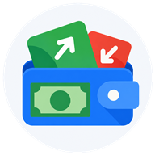
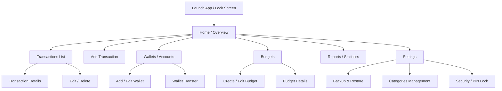

<div align="center">



# Cash Ledger

An expense and budget tracker for Android that keeps your money on your own phone.

[](https://www.gnu.org/licenses/gpl-3.0.html)
[](https://github.com/solomonrajan/cashledger/releases/latest)

[](https://github.com/solomonrajan/cashledger/releases/latest)

</div>

Cash Ledger tracks what you spend and what you have, across as many wallets as you keep. It runs with no network connection and asks for no account. [PRIVACY.md](PRIVACY.md) lists every way data leaves the app.

The GitHub Actions build is reproducible and carries the developer signature, so the APK attached to each [release](https://github.com/solomonrajan/cashledger/releases) can be installed directly and safely.

<div align="center">


</div>

## 📑 Table of Contents

| Section | Description |
|---------|-------------|
| [✨ What it does](#what-it-does) | Features and capabilities of Cash Ledger |
| [🗺️ App Blueprint](#app-blueprint) | UI/UX Flow and Navigation Map |
| [💻 Technology Stack](#technology-stack) | Languages, frameworks, and architecture used |
| [🔄 Coming from Tallybook](#coming-from-tallybook) | Information for users migrating from Tallybook |
| [📚 Docs](#docs) | Documentation, guides, and privacy policy |
| [🛠️ Build from source](#build-from-source) | Instructions to build the app from source |
| [🤝 Contributing](#contributing) | How to contribute to the project |
| [🙏 Credits and Acknowledgment](#credits-and-acknowledgment) | People and projects that made Cash Ledger possible |

## ✨ What it does

- **Wallets.** Keep as many as you need, each in its own currency.
- **Categories.** Group spending into categories and subcategories, and open a category total into the ones underneath it.
- **Budgets.** Set a limit for a period, cover more than one category with it, and let it repeat into the next period on its own.
- **Recurring transactions.** Post on a schedule you set, including transfers between wallets.
- **Debts and savings goals.** Track what you owe, what you are owed, and what you are putting aside.
- **Reports.** See a period's income and spending, with charts by category.
- **Calendar.** A day strip marks the days that have transactions.
- **Widget.** A home screen widget shows one wallet's balance.
- **Backup.** Write to a local folder, to your own WebDAV server such as Nextcloud or a NAS, or through Android's own backup.
- **Import and export.** CSV in, and CSV, XLS or PDF out, plus the older Tallybook backup file.
- **Lock.** An optional PIN, pattern or fingerprint when the app opens.

## 🗺️ App Blueprint

The following diagram illustrates the primary user flows and navigation structure within Cash Ledger:



## 💻 Technology Stack

Cash Ledger is built as a fully native and privacy-respecting Android application.

**Frontend & UI**
- **Language:** Java
- **Framework:** Native Android SDK (XML Layouts / Views)
- **Design System:** Material Design Components
- **Data Visualization:** MPAndroidChart for reports and statistics
- **Icons:** Material Design Icons, Phosphor Icons, Tabler Icons, Lucide, and Bootstrap Icons

**Backend & Storage**
- **Database:** Local SQLite (offline-first architecture, no accounts or cloud services required)
- **Backups:** Local storage, WebDAV (Nextcloud, NAS), and Android Auto Backup
- **Import/Export:** CSV, XLS, PDF, and legacy MoneyWallet backups

## 🔄 Coming from Tallybook

Tallybook is a maintained fork of [MoneyWallet](https://github.com/AndreAle94/moneywallet), which last had a release in 2021. It is a separate app with its own application id, so it installs beside the original and does not replace it or carry its data across on its own. [MIGRATION.md](https://github.com/herrerad85/tallybook/blob/master/MIGRATION.md) has the path that was tested. 

Cash Ledger is a fork of [Tallybook](https://github.com/herrerad85/tallybook).

## 📚 Docs

- [FAQ](docs/FAQ.md)
- [Moving from Tallybook](MIGRATION.md)
- [CSV import format](docs/CSV.md)
- [Privacy](PRIVACY.md)
- [Third party notices](THIRD_PARTY_NOTICES.md)

Every release note is on the [releases page](https://github.com/solomonrajan/cashledger/releases).

## 🛠️ Build from source

Build the `floss` + `osm` flavors, which use OpenStreetMap and no proprietary services:

```
./gradlew assembleFlossOsmDebug
```

Requirements: a recent Android SDK and JDK 17 or newer. Release builds use JDK 21, which is what the GitHub Actions build server uses, so a release built on an older JDK will not reproduce.

## 🤝 Contributing

Bug reports and pull requests are welcome in the [issue tracker](https://github.com/solomonrajan/cashledger/issues). Current direction and open work live in the pinned [roadmap issue](https://github.com/solomonrajan/cashledger/issues/15).

[CONTRIBUTING.md](CONTRIBUTING.md) has the bar a pull request is held to, including an AI written one, and the steps for translating.

## 🙏 Credits and Acknowledgment

Cash Ledger is free software under the GNU General Public License v3.0 or later, the same license as the project it came from. See [LICENSE.md](LICENSE.md).

MoneyWallet was written by AndreAle94 and its contributors. Tallybook is a fork of MoneyWallet by herrerad85 and its contributors. Cash Ledger is a fork of Tallybook and exists to keep that work usable. Cash Ledger is independent and is not endorsed by or affiliated with the original authors.

The app icon and the intro illustrations are original artwork for this fork, released under the GPLv3. The category picker icons place glyphs from Phosphor Icons (MIT), Tabler Icons (MIT), Lucide (ISC) and Bootstrap Icons (MIT) on original GPLv3 disc backgrounds, and a few are original artwork. The interface also uses Material Design Icons, licensed under Apache-2.0. Full license texts are in [THIRD_PARTY_NOTICES.md](THIRD_PARTY_NOTICES.md).
